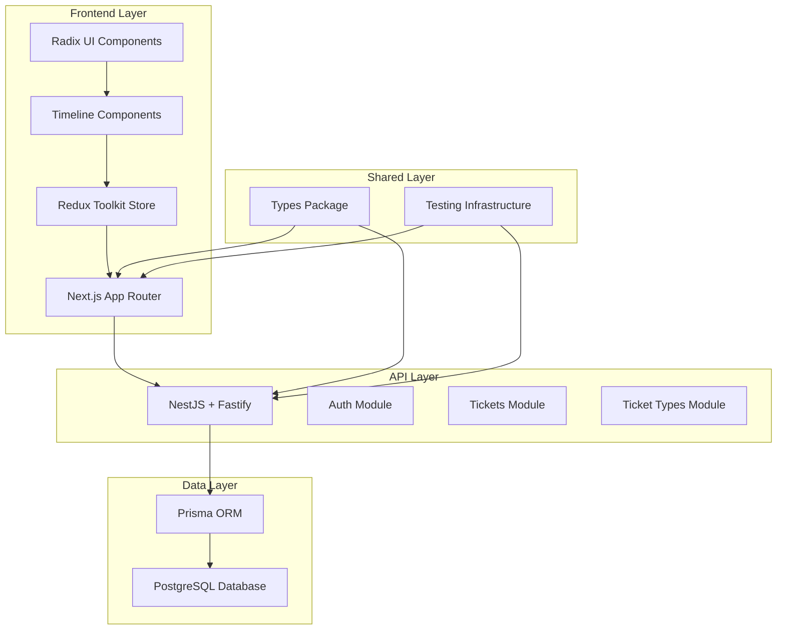
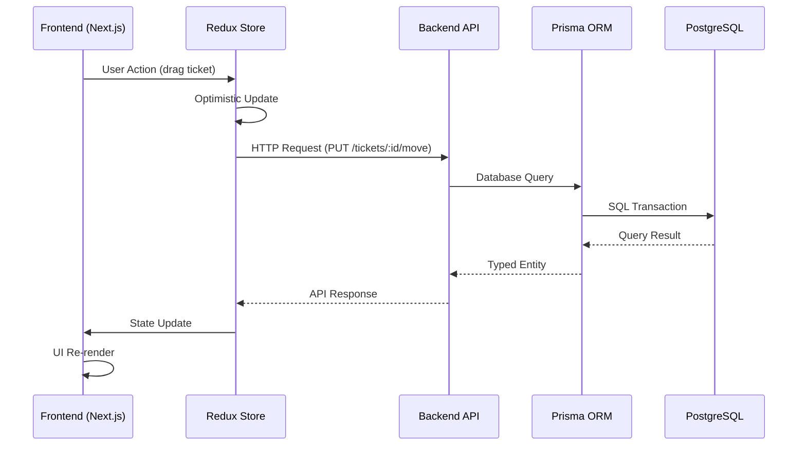
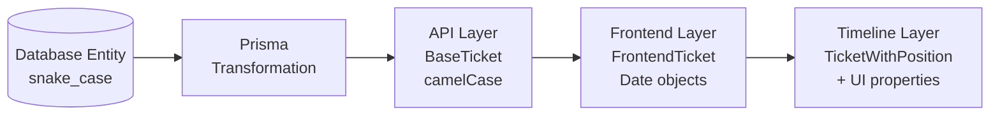

# WRM System Overview Architecture

| Date | Version | Description | Author |
|------|---------|-------------|--------|
| 2025-08-02 | 1.0 | Initial system overview from brownfield migration | Winston (Architect) |

## Executive Summary

WRM (Work Resource Management) Timeline is a sophisticated time management application built on a modern Deno monorepo architecture. The system combines a NestJS + Fastify + Prisma backend with a Next.js + Redux frontend to deliver dynamic timeline visualization with drag-and-drop interaction, custom ticket management, and planned AI assistance features.

**Current Status:** Epic 1 (Dynamic Timeline) ✅ **COMPLETE** - Epic 2 (Custom Properties) 🚧 **IN PROGRESS**

## High-Level Architecture

### System Architecture Diagram



### Technology Stack

#### Core Runtime & Framework
- **Runtime**: Deno 1.40+ (development and testing)
- **Backend Framework**: NestJS with Fastify adapter (high-performance HTTP)
- **Frontend Framework**: Next.js 15+ with App Router
- **Package Management**: Deno native with npm compatibility

#### Database & ORM
- **Database**: PostgreSQL 13+ with proper indexing
- **ORM**: Prisma for type-safe database operations
- **Schema Management**: Prisma migrations with version control
- **Data Validation**: Type-safe queries and mutations

#### Frontend Stack
- **UI Framework**: React 19+ with TypeScript
- **State Management**: Redux Toolkit with async thunks
- **UI Components**: Radix UI primitives with Tailwind CSS
- **Build System**: Next.js optimized bundling

#### Development & Testing
- **Testing**: Deno built-in test runner + Jest (frontend)
- **Type Safety**: Centralized `@wrm/types` package
- **Validation**: Automated type consistency checking
- **Development**: Hot reload across all packages

### Repository Structure (Deno Workspace)

```
WRM/
├── packages/
│   ├── backend/         # NestJS + Fastify + Prisma API
│   ├── frontend/        # Next.js + Redux UI
│   ├── types/          # Shared TypeScript definitions
│   └── testing/        # Comprehensive test suites
├── docs/
│   ├── architecture/   # Modular architecture docs
│   ├── prd/           # Product requirements
│   └── stories/       # User story specifications
└── deno.json          # Workspace configuration
```

## Epic Implementation Status

### ✅ Epic 1: Dynamic Timeline (COMPLETE)

**Implementation Scope:**
- Multi-view timeline (daily/weekly)
- Drag-and-drop ticket manipulation
- Real-time visual feedback and conflict detection
- Time-aware state visualization
- Performance-optimized rendering

**Technical Architecture:**
- **Frontend**: Hook-based modular architecture (`useTimeline`, `useTimelineDrag`, etc.)
- **State Management**: Redux Toolkit with optimistic updates
- **Performance**: Sub-50ms feedback, 500+ ticket optimization
- **Testing**: Comprehensive drag-drop test suite

### 🚧 Epic 2: Custom Properties (IN PROGRESS)

**Implementation Scope:**
- Custom ticket type creation and management
- Dynamic property schema definition
- Form generation for custom fields
- Settings page infrastructure

**Current Progress:**
- Redux state management foundation (✅ Complete)
- Basic ticket types API structure (🚧 In Progress)
- Frontend settings page framework (📋 Planned)

### 📋 Epic 3: AI Assistant (PLANNED)

**Planned Scope:**
- Chat and voice interaction interface
- Proactive ticket creation and suggestions
- Natural language command processing
- Agent configuration and autonomy settings

### 📋 Epic 4: Social Collaboration (PLANNED)

**Planned Scope:**
- Timeline and ticket sharing
- Project creation and collaboration
- Friend management and permissions
- Real-time collaborative updates

## Data Flow Architecture

### Request/Response Flow



### Type Transformation Pipeline



## Performance Architecture

### Frontend Performance
- **Timeline Rendering**: Optimized for 500+ tickets with virtualization planning
- **Drag Operations**: Sub-50ms visual feedback requirement
- **State Updates**: Efficient Redux patterns with proper memoization
- **Bundle Size**: Code splitting and lazy loading for non-critical features

### Backend Performance
- **API Response Times**: 95th percentile under 500ms
- **Database Queries**: Proper indexing on timeline-related fields
- **Concurrent Users**: Design for 100+ concurrent users per instance
- **Memory Management**: Efficient Prisma query patterns

### Real-time Features
- **WebSocket Integration**: Planned for Epic 3 and 4 collaboration features
- **Optimistic Updates**: Immediate UI feedback with server reconciliation
- **Conflict Resolution**: Timeline collision detection and user notification

## Security Architecture Overview

### Authentication & Authorization
- **JWT-based Authentication**: 15-minute access tokens with refresh rotation
- **API Security**: Rate limiting (100 requests/minute per user)
- **Session Management**: Automatic logout after 24 hours inactivity
- **Password Security**: bcrypt hashing with salt rounds ≥12

### Data Protection
- **Encryption**: AES-256 at rest, TLS 1.3 in transit
- **User Isolation**: Strict per-user data access controls
- **Input Validation**: Server-side validation for all user inputs
- **OWASP Compliance**: Protection against top 10 vulnerabilities

### Privacy & Compliance
- **Data Retention**: 30-day deletion policy for user accounts
- **Audit Logging**: Security events with 90-day retention
- **Privacy Controls**: Granular sharing permissions for social features

## Scalability Considerations

### Horizontal Scaling
- **Backend**: Stateless NestJS instances behind load balancer
- **Database**: PostgreSQL with read replicas for timeline queries
- **Frontend**: CDN distribution for static assets
- **Caching**: Redis for session management and frequently accessed data

### Vertical Scaling
- **Database Optimization**: Proper indexing on time-based queries
- **Memory Management**: Efficient Prisma connection pooling
- **CPU Optimization**: Fastify adapter for high-performance HTTP handling

## Integration Architecture

### External Service Integration
- **AI Services**: External API integration for Epic 3 (planned)
- **Voice Recognition**: Browser Web Speech API
- **Real-time Communication**: WebSocket infrastructure for collaboration
- **Email Services**: User notifications and friend invitations

### Development Tool Integration
- **Type Safety**: Automated validation with `@wrm/types` package
- **Testing**: Deno test runner + Jest for comprehensive coverage
- **Documentation**: Automated API docs from OpenAPI specifications
- **Monitoring**: Performance tracking for timeline operations

## Migration and Deployment

### Development Environment
- **Local Setup**: `deno task dev` for full-stack development
- **Database**: PostgreSQL with Prisma migrations
- **Testing**: Automated test suites with CI/CD integration
- **Type Checking**: Real-time validation across packages

### Production Deployment
- **Infrastructure**: Container-based deployment (Docker/Kubernetes)
- **Database**: Managed PostgreSQL with backup strategy
- **Monitoring**: Application performance monitoring (APM)
- **Security**: Web application firewall (WAF) and DDoS protection

## Future Architecture Considerations

### Epic 3 (AI Assistant) Preparation
- **LLM Integration**: External AI API with fallback mechanisms
- **Context Management**: Conversation state and user preference storage
- **Performance**: AI request queuing and response caching

### Epic 4 (Social Features) Preparation
- **Real-time Infrastructure**: WebSocket server with connection management
- **Collaboration State**: Multi-user conflict resolution patterns
- **Permission System**: Granular access control for shared resources

### Long-term Scalability
- **Microservices**: Potential service decomposition for large scale
- **Event Sourcing**: Timeline state management with event streams
- **Global Distribution**: Multi-region deployment for international users

---

*Next: [Data Architecture](./data-architecture.md) | [Epic 1 Architecture](./epic-1-timeline-architecture.md)*
